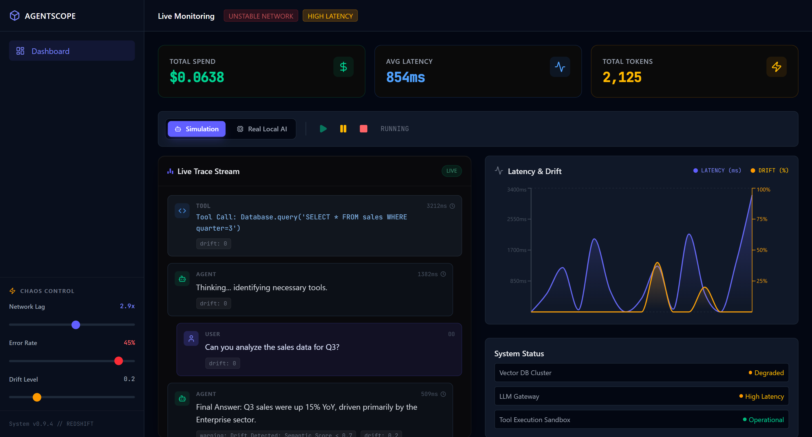
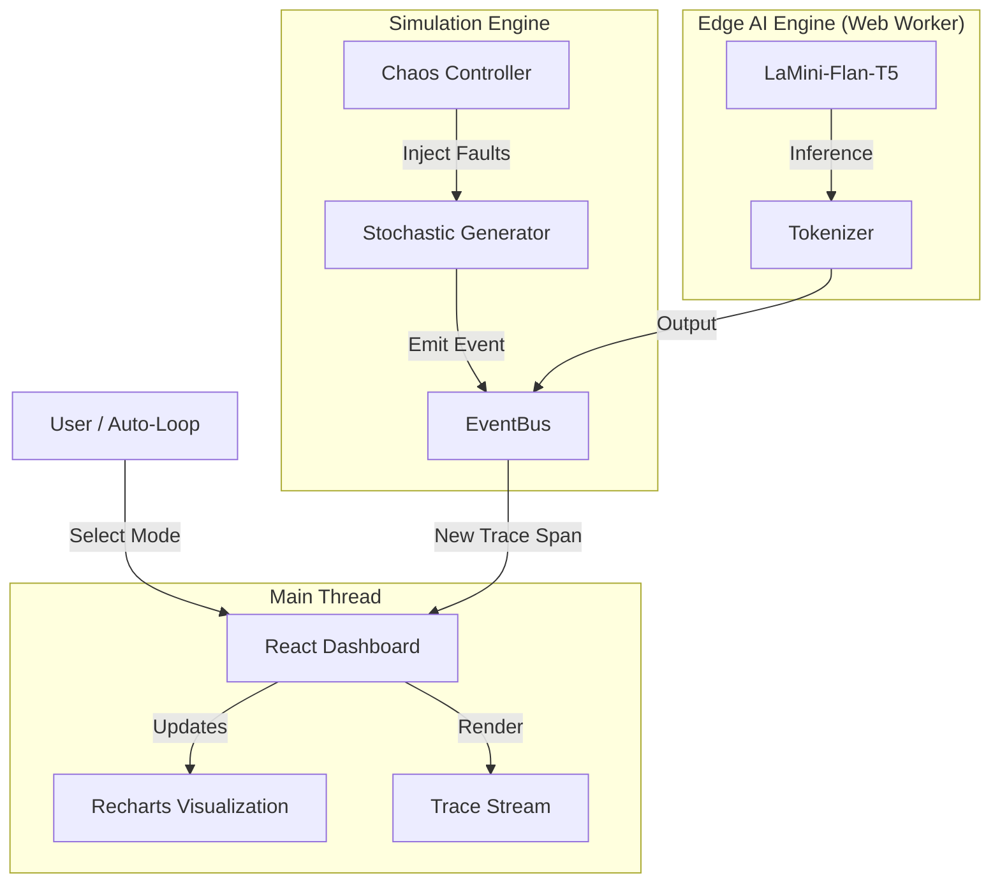

# AgentScope 🔭
### Client-Side Agent Observability Platform with Local Edge Inference


> **[🔴 View Live Demo](https://devanshmistry890.github.io/Agent-scope/)**
> *Experience the full dashboard with zero installation. Runs 100% in your browser.*

---

## 📸 Dashboard Preview


*The AgentScope Control Center: Visualizing latency water-falls, token consumption, and drift detection in real-time.*

---

## 📖 Overview

**AgentScope** is a zero-dependency observability platform designed to bridge the gap between simulation and real-world Edge AI execution. While tools like LangSmith or Datadog require complex backend instrumentation and enterprise budgets, AgentScope provides a **client-side playground** to master MLOps concepts.

It operates in two distinct modes:
1.  **Simulation Engine:** A stochastic generator that mimics complex agentic workflows, allowing users to practice "Chaos Engineering" by injecting network lag and error spikes.
2.  **Edge AI Execution:** A fully functional local inference environment using **Transformers.js (WebGPU)**, running quantized models (LaMini-Flan-T5) directly in the browser to profile *actual* inference latency and token costs without external APIs.

### 🚀 Key Capabilities

* **⚡ Live Trace Waterfall:** Visualizes the "Chain of Thought" execution path (User → Agent → Tool → Result) with millisecond-precision timing.
* **🧪 Chaos Engineering:** Interactive controls to stress-test system resiliency. Slide the "Error Rate" or "Network Lag" bars to see how the dashboard handles system degradation and drift.
* **🤖 100% Local Inference:** Integrated with **Transformers.js** to run real LLMs via WebAssembly. No Python backend, no API keys, and no server costs.
* **💸 Enterprise Cost Modeling:** Simulates token-based billing logic (Input vs. Output tokens) to track spend accumulation in real-time.
* **📉 Drift Detection:** Visualizes semantic drift over time, triggering automated alerts when response quality degrades below defined thresholds.

---

## 🛠️ Tech Stack & Architecture

This project pushes the limits of what is possible in a static web application, utilizing multi-threading and hardware acceleration.

| Component | Technology | Role |
| :--- | :--- | :--- |
| **Frontend** | **React 19 + Vite** | High-performance UI rendering and state management. |
| **Styling** | **Tailwind CSS v4** | Modern, responsive, utility-first design system. |
| **AI Engine** | **Transformers.js** | Runs `Xenova/LaMini-Flan-T5-783M` via WebGPU/WASM. |
| **Visualization** | **Recharts** | Rendering high-frequency time-series data (Drift/Latency). |
| **Concurrency** | **Web Workers** | Off-loading heavy AI inference from the main UI thread. |
| **Deployment** | **GitHub Pages** | Static hosting with custom Service Worker headers. |

### System Architecture



---

## ⚡ Engineering Challenges & Decisions

### 1. Enabling SharedArrayBuffer on Static Hosting

**Challenge:** Running multi-threaded WASM (required for the ONNX Runtime) requires `SharedArrayBuffer`, which is blocked by modern browsers unless specific security headers (`Cross-Origin-Opener-Policy` and `Cross-Origin-Embedder-Policy`) are present. GitHub Pages does not support setting these headers.
**Solution:** Implemented a **Service Worker Injection** strategy using `coi-serviceworker`. This intercepts page load requests client-side and injects the required headers locally, "tricking" the browser into enabling a secure context for WebGPU.

### 2. Main Thread vs. Worker Thread

**Challenge:** Loading and running an 800MB model directly in React freezes the UI, creating a terrible user experience.
**Solution:** The AI inference engine is isolated in a dedicated **Web Worker**. Communication happens via asynchronous message passing. This ensures the Dashboard remains responsive (60fps) even while the LLM is crunching tokens in the background.

### 3. Simulation Realism

**Challenge:** Random data looks fake.
**Solution:** The Simulation Engine uses a weighted state machine. It follows a logical flow (`Thinking` -> `Tool Call` -> `Tool Result` -> `Answer`) rather than pure randomness. Latency is calculated using a log-normal distribution to mimic real-world API server response times.

---

## 📦 Installation & Setup

Since this is a client-side application, you can run it locally with Node.js.

### 1. Clone & Install

```bash
git clone [https://github.com/DevanshMistry890/Agent-scope.git](https://github.com/DevanshMistry890/Agent-scope.git)
cd Agent-scope
npm install

```

### 2. Run Development Server

```bash
npm run dev

```

> Open `http://localhost:5173` to view the dashboard.

### 3. Deployment (GitHub Pages)

The project includes a custom GitHub Actions workflow to handle the Vite build and static deployment.

```bash
npm run deploy

```

---

## 🛡️ License

This project is open-source and available under the MIT License.

---

*Built by [Devansh Mistry](https://github.com/DevanshMistry890) — AI Engineer.*